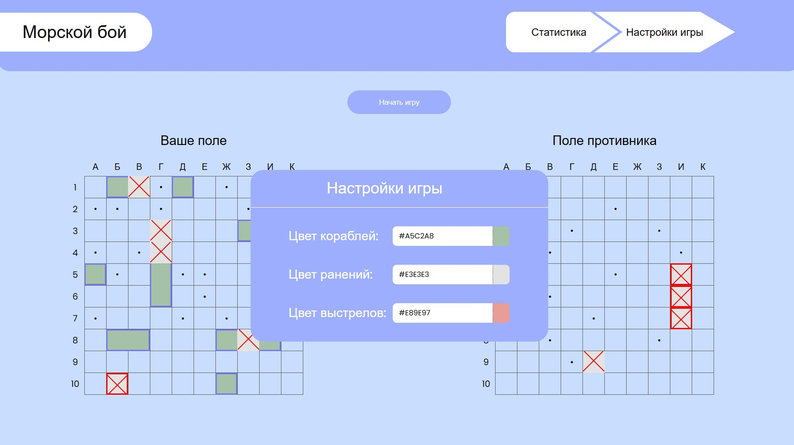

# Морской бой

ИС позволяет самому расставить корабли на своем поле, либо они могут быть расставлены автоматически
<figure align="center">
  
  <figcaption>Рисунок 1 - окно старта</figcaption>
</figure>

---

Само сражение происходит с ботом. Игра идет по правилам морского боя. Есть возможность сдаться.
<figure align="center">
  
  <figcaption>Рисунок 2 - окно сражения</figcaption>
</figure>

---
Во время сражения пользователь может настроить внешний вид элементов сражения (корабли, снаряды и т.д), а также увидеть статистику своих игр
<figure align="center">
  
  <figcaption>Рисунок 3 - модальное окно настроек</figcaption>
</figure>
